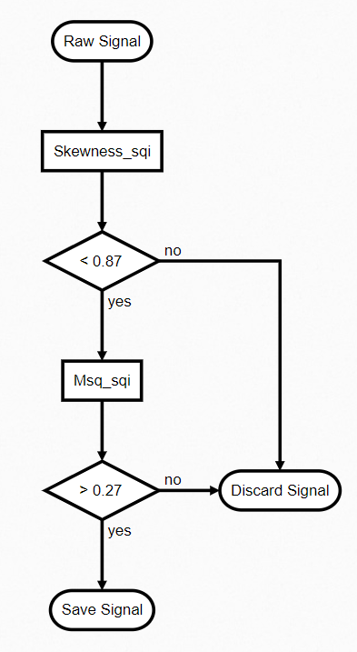

# Vital_sqi: Signal quality control of physiological signals

[](https://travis-ci.com/meta00/vital_sqi)
[](https://codecov.io/gh/meta00/vital_sqi)
[](https://vitalsqi.readthedocs.io/en/latest/?badge=latest)
[](https://opensource.org/licenses/MIT)


# Description
Vital_sqi is a Python package for signal quality index (SQI) extraction and quality assignment 
for ECG and PPG waveforms. The package provides:

1. Support PPG and ECG waveforms in various data formats extracted from wearables.
2. Unified framework for state-of-the-art SQIs: standard statistics, HRV, R peak, waveform, and template matching 
  based SQIs.
3. Rule-based classification of signal quality using user-defined thresholds for the extracted SQIs per signal segment.
4. Pipeline and GUIs for SQI extraction and quality assignment. 

# Prerequisites and Installation

The package works with `Python 3.7` and `Python 3.8`.

```cmd
pip install vital_sqi
```

# Getting started
The package is built around three classes: `SignalSQI` `Rule` `Ruleset`

1. `signal_obj` `SignalSQI` object, has the following attributes:
    - `signal_obj.signal` containing waveform data (pandas dataframe).
    - `signal_obj.sampling_rate` containing sampling rate, either input by user or automatically inferred from the waveform.
    - `signal_obj.sqis` containing SQIs (pandas dataframe) that are derived by functions of `vital_sqi.sqi` modules or an 
    external table, with SQI values as columns and signal segments as rows. After signal classification, decision of
      `accept` or `reject` for each signal segment is in `decision` column. If signal segmentation is done with the package,
      the table will contain also coordinates in column `start` and `end`.
    - `signal_obj.rules` and `signal_obj.ruleset` containing a list of `rules` and a `ruleset` used for signal classification.
2. `rules` list of `Rule` objects, in which each corresponds to an SQI and contains thresholds for quality assignment. 
    Rules could be read into `signal_obj` from `.json` file in the following format:
  ```python
    "test_sqi": {
        "name": "test_sqi",
        "def": [
            {"op": ">", "value": "10", "label": "reject"},
            {"op": ">=", "value": "3", "label": "accept"},
            {"op": "<", "value": "3", "label": "reject"}],
        "desc": "",
        "ref": ""
  }
  ```
3. `ruleset` object of class `Ruleset` contains a set of selected `rules` (selected from the list of rules in `signal_obj.rule`) and the order to apply them in quality 
assignment (see schema below). Notice that this is not a tree-based classification.
  


## Pipelines and GUIs
The package includes two pipelines for ECG (similarly for PPG) data as follows:
- `vital_sqi.pipeline_highlevel.get_ecg_sqis` to extract SQIs for ECG segments.
    ```python
        from vital_sqi.pipeline.pipeline_highlevel import *
        from vital_sqi.data.signal_sqi_class import SignalSQI
        import os
        file_in = os.path.abspath('tests/test_data/example.edf')
        sqi_dict = os.path.abspath('tests/test_data/sqi_dict.json')
        segments, signal_sqi_obj = get_ecg_sqis(file_in, sqi_dict, 'edf')
    ```  

- `vital_sqi.pipeline_highlevel.get_qualified_ecg` to extract SQIs, use those to classify ECG signal as `accept` or
  `reject` using user-defined thresholds. The `rules` and `ruleset` are defined in json format. Templates are found in 
  `vital_sqi/resource` folder: `sqi_dict.json` for `rules` and `rule_dict_test.json` for `ruleset`. 
    ```python
        from vital_sqi.pipeline.pipeline_highlevel import *
        from vital_sqi.data.signal_sqi_class import SignalSQI
        import os
        file_in = os.path.abspath('tests/test_data/example.edf')
        sqi_dict = os.path.abspath('tests/test_data/sqi_dict.json')
        rule_dict_filename = os.path.abspath('tests/test_data/rule_dict_test.json')
        ruleset_order = {3: 'skewness_1', 2: 'entropy', 1: 'perfusion'}
        output_dir = tempfile.gettempdir()
        signal_obj = get_qualified_ecg(file_name=file_in,
									sqi_dict_filename=sqi_dict,
									file_type='edf', duration=30,
									rule_dict_filename=rule_dict_filename,
									ruleset_order=ruleset_order,
									output_dir=output_dir)
    ```

We also provide an GUI to easily define `rule` and `ruleset`, and execute them with an input SQI table (Help - hyperlink to readthedocs)

## S
The module `vital_sqi.data` provides functions to read (and write) data in the following formats:

- ECG: EDF, MIT (physio.net), csv.
- PPG: csv.
Data is read into an object of `SignalSQI class`:
```python
import vital_sqi.data
ecg_obj = ECG_reader()
ppg_obj = PPG_reader()
```

## Preprocessing
## SQI extraction
## Quality assignment

# References

# Authors

# License

# How to contribute

# Acknowledgements


## PPG
1. Data format
   
2. Preprocessing

2.1. Trimming: First and last 5 minutes of each recording are trimmed as they usually contain unstable signals. Wearables need some time to pick up signals.

2.2. Noise removal: The following is considered noise, thus removed. The recording is then split into files.
   - PLETH column: 0 or unchanged values for xxx time
   - Invalid values: SpO2 < 80 and Pulse > 200 or Pulse < 40
   - Perfusion < 0.2
   - Lost connection: sampling rate reduced due to (possible) Bluetooth connection lost. Timestamp column shows missing timepoints. If the missing duration is larger than 1 cycle (xxx ms), recording is split. If not, missing timepoints are interpolated.

3. Filtering

3.1. Bandpass filter: High pass filter (cut off at 1Hz)

3.2. Detrend

4. Split Data 

4.1. Cut data by time domain. Split data into sub segments of 30 seconds

4.2. Apply the peak and trough detection methods in peak_approaches.py 
to get single PPG cycles in each segment 

4.3. Shift baseline above 0 and 
tapering each single PPG cycle to compute the mean template

Notes: the described process is implemented in split_to_segments.py

5. SQI scores

Most of the statistical SQI is adopted from the paper
<i>Optimal Signal Quality Index for Photoplethysmogram Signals, Mohamed Elgendi</i>

The indices are classified into statistical domain (skewness, kurtosis,...) 
and signal processing domain (entropy, zero crossing rate, mean crossing rate). 
Besides these two domains, we used the dynamic time warping with different templates 
as another domain. 

The PPG templates are generated in <i>generate_template.py</i>

The mean template is compared with each generated templated. According to DTW techniques,
a list of key mapping is projected. The DTW score compute the ratio from the mean distance 
of the mapping points and the trace of the difference matrix.

### utilities package
1) Filtering

1.1. Bandpass filtering: includes high-pass and low-pass filtering. Usage: remove any additive signal frequency below or above the cutoff threshold 

1.2. Tapering: Pin the leftmost and rightmost signal to the zero baseline
    and amplify the remainder according to the window shape (ex: hann, cosine,...)

1.3.  Scale pattern: spanning or squeeze the selected sequence to the chosen window size. 
Use to equalized the single complex/cycle of PPG

1.4. Smooth: use a convolution windows to smooth the scale or squeeze signal

2) Generate template

Generate a synthetic data of PPG and ECG

2.1.  ppg_dual_doublde_frequency_template

Generate a PPG template by using 2 sine waveforms.
    The first waveform double the second waveform frequency
    
2.2.  ppg_absolute_dual_skewness_template

Generate a PPG template by using 2 skewness distribution. Return a 1-D numpy array of PPG waveform
    having diastolic peak at the high position
    
2.3.  ppg_nonlinear_dynamic_system_template

Generate a PPG template from the paper 
<i>An Advanced Bio-Inspired PhotoPlethysmoGraphy (PPG) and ECG Pattern Recognition System for Medical Assessment</i>

2.4. ecg_dynamic_template

Generate a ECG synthetic template from the paper
<i>A dynamical model for generating synthetic electrocardiogram signals</i>

3) peak_approaches

Contains a list of PPG peak detection methods as described in 
<i>Systolic Peak Detection in Acceleration Photoplethysmograms Measured
    from Emergency Responders in Tropical Conditions</i>

3.1. detect_peak_trough_kmean

Using clustering technique to separate the list of systolic and diastolic peak

3.2. detect_peak_trough_count_orig

using local extreme technique with threshold

3.3. detect_peak_trough_slope_sum

analyze the slope sum to get local extreme

3.4. detect_peak_trough_moving_average_threshold

examine second derivative and the average line to determine threshold

### sqi packages

SQI.py includes list of all available SQI scores as described in the paper
<i>Elgendi, Mohamed, Optimal signal quality index for photoplethysmogram signals, Bioengineering,</i>

There are 3 types of SQI: statistical domain, signal processing domain & DTW domain
- statistical domain: kurtosis_sqi, skewness_sqi, entropy_sqi
- signal processing domain: zero_crossings_rate_sqi, signal_to_noise_sqi, mean_crossing_rate_sqi
- DTW domain: dtw_sqi

## ECG

1. Data format

2. Preprocessing

2.1. Trimming: First and last 5 minutes of each recording are trimmed as they usually contain unstable signals. Wearables need some time to pick up signals.

2.2. Noise removal: The following is considered noise, thus removed. The recording is then split into files.

2.3.

# Installation
```
pip install vital_sqi
```
# Contributing
# License

